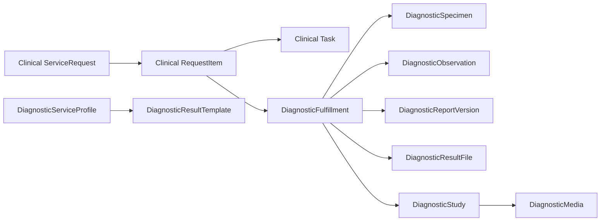

# Diagnostics Module

> Unified laboratory, radiology, and pathology workflows for FlowRise HMS.

The `Diagnostics` module extends the main clinical ordering flow instead of replacing it. Clinicians still order services through Clinical. Diagnostics takes those ordered items, turns them into operational fulfillments, and gives lab, radiology, and pathology teams a dedicated place to work on specimens, files, reports, and study records.

This document is written as the canonical guide for the module. It is meant to be useful to:

- clinical and diagnostic staff who need to understand how work moves through the system
- administrators who need to seed, configure, and govern the module
- developers who need to extend or maintain the module safely

## Current Status

Diagnostics is **in progress**.

What is already present:

- Clinical-to-Diagnostics bridge from `RequestItem` creation/cancellation into `DiagnosticFulfillment`
- core schema for profiles, templates, fulfillments, specimens, observations, reports, report signatures, files, studies, and media
- Filament resources for:
  - `DiagnosticFulfillment`
  - `DiagnosticServiceProfile`
  - `DiagnosticResultTemplate`
- workflow-oriented permissions and Shield-style resource permissions
- starter seed data for common small-clinic diagnostics across lab, radiology, and pathology

What is still being expanded:

- richer structured observation capture driven directly from default templates during result entry
- deeper panel/reference-range/component modeling
- broader radiology scheduling/allocation depth
- fuller pathology and interoperability workflow coverage

Use this README as both:

- the mental model for how Diagnostics is supposed to work
- the implementation map for what exists right now

## Mental Model

### The shortest explanation

Think of Diagnostics as the **fulfillment layer** for ordered diagnostic services.

- **Clinical** decides *what was ordered*
- **Diagnostics** manages *how the order is worked, documented, and released*
- **Billing** still anchors on the original ordered line item

### The core chain

```text
ServiceRequest -> RequestItem -> Task -> DiagnosticFulfillment
```

The meaning of each layer:

- `ServiceRequest`: the order header, linked to encounter context or a guest walk-in
- `RequestItem`: the individual billable diagnostic line such as FBC, Chest X-Ray, or Histopathology
- `Task`: operational queue/work pickup in Clinical
- `DiagnosticFulfillment`: the diagnostics-side work order where specimens, observations, reports, result files, and studies live

### Why this matters

This separation keeps the system easy to reason about:

- clinicians do not need a second order-entry system
- diagnostics staff get a dedicated workflow surface
- billing remains stable because it stays tied to the original ordered item
- external result files can be handled without forcing full structured transcription

### The working picture



## The Operating Model

### What the module is designed to optimize for

The module is deliberately small-clinic-first:

- the fastest safe path should be the normal path
- uploading an outside result is a valid first-class workflow
- structured entry is encouraged where it helps speed, reporting, and consistency
- templates exist to reduce repetitive typing, not to make staff think like data modelers
- walk-in diagnostics must work even if the person is not yet a registered patient

### Three valid result modes

Diagnostics is designed around three mental models for result capture:

1. **Structured-only**
   Staff enter a result into a template-driven structure and the system stores the diagnostic data as normalized records.

2. **File-only**
   Staff upload an external PDF, DOCX, or image and mark the fulfillment/report appropriately.

3. **Mixed**
   Staff upload a file and also capture key structured values in the system.

This flexibility is important in environments where some tests are performed in-house while others come from outside laboratories or external imaging centers.

Today, the strongest implemented operational surface is the fulfillment/report/file workflow. Richer template-driven structured capture is part of the current module direction and is still being expanded.

## How Diagnostics Fits Into Clinical Care

### Scenario 1: A normal outpatient diagnostic order

1. A clinician opens an encounter or relevant patient/guest context.
2. The clinician creates a `ServiceRequest`.
3. One or more diagnostic `RequestItem`s are added, such as:
   - `Full Blood Count (FBC)`
   - `Chest X-Ray`
4. Clinical queue/task logic creates the operational task context.
5. Diagnostics listens for the new `RequestItem`.
6. Diagnostics creates one `DiagnosticFulfillment` per diagnostic request item.
7. Diagnostic staff work from the Diagnostics worklist, not from the raw order tables.
8. The fulfillment accumulates the real diagnostic work:
   - specimen collection
   - uploaded result files
   - observations
   - reports
   - studies/media
9. Once the diagnostic work is finalized, the fulfillment reflects that status and the record becomes available for downstream review.

### Scenario 2: A walk-in guest comes only for a test

1. Staff create a guest-facing `ServiceRequest` with no linked patient record yet.
2. A diagnostic `RequestItem` is added as usual.
3. Diagnostics still creates a `DiagnosticFulfillment`.
4. The diagnostic work proceeds normally.
5. If that guest later becomes a full patient, their older guest-originated diagnostic data should be linked deliberately, not silently rewritten.

This preserves auditability and avoids accidental merges.

### Scenario 3: An external laboratory sends back a PDF

1. A diagnostic fulfillment already exists for the request item.
2. Staff open the fulfillment.
3. They upload the result file using the result-file relation manager.
4. Staff may optionally finalize, verify, sign, or amend the report depending on role and workflow.
5. The uploaded file remains attached to the fulfillment and can optionally be linked to a report version.

This is essential for clinics that depend on outside labs or imaging partners.

### Scenario 4: Histopathology or biopsy workflow

1. A biopsy or pathology-related diagnostic service is ordered.
2. A pathology `DiagnosticFulfillment` is created.
3. Staff can track the pathology work under the same fulfillment model used by lab/radiology.
4. Narrative-style reporting is handled through the report layer and optional signatures.

The workflow is intentionally lean in v1: it supports pathology as a first-class discipline without demanding a heavyweight LIS/RIS-style orchestration layer.

## What End Users Should Expect

### For clinicians

Clinicians should think:

> “I keep using Clinical to place diagnostic orders. Diagnostics is where the diagnostic departments work the order.”

The clinician does not need to understand the whole Diagnostics schema. The clinician mainly needs to know:

- diagnostics orders still begin in Clinical
- results may come back as structured data, files, or both
- diagnostic services are still ordinary ordered services from the clinical perspective

### For laboratory, radiology, and pathology staff

Diagnostic staff should think:

> “Every diagnostic order becomes a fulfillment. I work the fulfillment until a result is ready.”

The key questions they should be able to answer from a fulfillment are:

- what was ordered?
- for whom was it ordered?
- what discipline is this?
- has a specimen been collected?
- are there result files?
- what is the latest report version?
- can I perform the next action based on my permissions?

### For front desk / walk-in workflows

Staff should think:

> “A person can come only for a test. Diagnostics should still work even if full patient registration has not happened yet.”

The module is designed around that reality.

## Current Filament Surface

The Diagnostics Filament cluster currently centers around three resources:

### 1. `DiagnosticFulfillment`

This is the operational worklist.

What it currently provides:

- table view with request, service, patient/guest, discipline, status, and counts
- filters for discipline and fulfillment status
- infolist for request and related-record context
- relation managers for:
  - report versions
  - result files
- workflow actions such as:
  - schedule
  - collect specimen
  - start processing
  - finalize result
  - verify result
  - sign report
  - amend report

This is the current best entry point for diagnostics operations.

### 2. `DiagnosticServiceProfile`

This is the admin-facing catalog extension layer.

What it currently provides:

- link from a Core `Service` into a diagnostic profile
- discipline assignment (`lab`, `radiology`, `pathology`)
- LOINC metadata
- active/inactive flag
- metadata storage

Use this when configuring which services should behave as true diagnostics services.

### 3. `DiagnosticResultTemplate`

This is the admin-facing template manager.

What it currently provides:

- one or more templates under a diagnostic service profile
- one default template per profile in seeded starter data
- starter fields to accelerate structured result entry

These templates are the bridge between operational speed and structured data quality.

## Starter Seed Data

Diagnostics now ships with starter seeding so new environments do not begin empty.

### What the starter seed does

The starter seeder:

- reuses existing Core lab/radiology services where names already exist
- adds a `Pathology` service category if needed
- creates missing but common small-clinic diagnostics
- creates `DiagnosticServiceProfile` records for seeded diagnostic services
- creates one default `DiagnosticResultTemplate` per seeded profile

### Example starter services

Laboratory starters include:

- `Full Blood Count (FBC)`
- `Urinalysis`
- `Malaria Test (RDT)`
- `Blood Glucose`
- `Typhoid Test`
- `Lipid Profile`
- `Liver Function Test`
- `Renal Function Test`
- `Electrolytes / Urea / Creatinine`
- `Pregnancy Test`
- `HIV Screening`
- `HBsAg`
- `HCV Screening`
- `Stool Microscopy`
- `Microscopy, Culture and Sensitivity`
- `HbA1c`

Radiology starters include:

- `Chest X-Ray`
- `Head CT Scan`
- `Abdominal Ultrasound`
- `ECG (Electrocardiogram)`
- `Pelvic Ultrasound`
- `Obstetric Ultrasound`

Pathology starters include:

- `Histopathology`
- `Cytology`
- `Biopsy Examination`

### Seeding principle

If a matching Core service already exists, Diagnostics enriches it instead of duplicating it. That keeps pricing and service identity stable.

## Permissions and Roles

Diagnostics uses both:

- Shield-style resource permissions for Filament access
- custom workflow permissions for non-CRUD operational actions

### Examples of workflow permissions

- `assign_diagnostic_fulfillment`
- `collect_diagnostic_specimen`
- `upload_diagnostic_result_file`
- `finalize_diagnostic_result`
- `verify_diagnostic_result`
- `sign_diagnostic_report`
- `amend_diagnostic_report`

### Practical effect

This means a role can be allowed to:

- see the fulfillment worklist
- upload result files
- finalize a result
- verify a result
- sign a report

without necessarily receiving unrestricted access to all other actions.

## Administrator Guide

### What must be configured first

Before staff can use Diagnostics effectively, an administrator should confirm:

- Core service categories and services are seeded
- Diagnostics migrations have run
- Diagnostics seeders have run
- users have the right roles and permissions
- diagnostic service profiles and templates are reviewed after starter seeding

### Recommended setup order

```text
1. Run Core migrations and seeders
2. Run Diagnostics migrations
3. Run Diagnostics seeders
4. Review starter services and prices
5. Review diagnostic service profiles
6. Review and edit default templates
7. Assign roles and permissions
8. Train staff on the fulfillment worklist
```

### Useful commands

```bash
php artisan module:migrate Diagnostics
php artisan db:seed --class="Modules\\Diagnostics\\Database\\Seeders\\DiagnosticsDatabaseSeeder"
php artisan test Modules/Diagnostics/tests/Feature
```

### Admin responsibilities after seeding

Starter data is meant to get a clinic moving quickly, not to replace local governance.

Admins should still review:

- local pricing
- service activation/deactivation
- which templates should remain default
- whether additional local-only diagnostic services are needed
- which roles should verify, sign, or amend reports

## Developer Guide

### Module boundaries

Diagnostics deliberately does **not** replace:

- Clinical ordering
- Billing line items
- Patient registration

Instead it extends them.

The module depends most directly on:

- `Core` for services, categories, branches, and shared platform concepts
- `Clinical` for `ServiceRequest`, `RequestItem`, `Task`, and request-item events

### Important providers and listeners

- `Modules\Diagnostics\Providers\DiagnosticsServiceProvider`
- `Modules\Diagnostics\Providers\EventServiceProvider`
- `Modules\Diagnostics\Listeners\CreateDiagnosticFulfillmentFromRequestItem`
- `Modules\Diagnostics\Listeners\CancelDiagnosticFulfillmentFromRequestItem`

These listeners are what keep the shared Clinical ordering backbone connected to Diagnostics work records.

### Current schema surface

The implemented schema currently covers:

- `diagnostic_service_profiles`
- `diagnostic_result_templates`
- `diagnostic_result_template_fields`
- `diagnostic_fulfillments`
- `diagnostic_specimens`
- `diagnostic_observations`
- `diagnostic_report_versions`
- `diagnostic_report_observations`
- `diagnostic_report_signatures`
- `diagnostic_result_files`
- `diagnostic_studies`
- `diagnostic_media`

This is an intentionally useful v1 slice, not yet the full long-term diagnostics schema.

### Current Filament resource layout

The module follows the project’s clustered Filament resource structure under:

```text
Modules/Diagnostics/app/Filament/Clusters/Diagnostics/Resources/
```

Current resource roots:

- `DiagnosticFulfillments`
- `DiagnosticServiceProfiles`
- `DiagnosticResultTemplates`

### Tests

Diagnostics feature coverage currently validates:

- domain contracts
- schema relationships
- review regressions for bridge/resource/policy coverage
- support infrastructure including permissions, factories, and starter catalog seeding

Run the module tests with:

```bash
php artisan test Modules/Diagnostics/tests/Feature
```

### Metadata and package files

Diagnostics is described by:

- `Modules/Diagnostics/composer.json`
- `Modules/Diagnostics/module.json`

Keep these accurate whenever the module boundary or purpose changes. They are the first signals for maintainers, tooling, and future packaging.

## How the Whole Workflow Was Intended to Feel

The intended operator experience is:

- clinicians keep ordering where they already work
- diagnostics staff live in a dedicated fulfillment queue
- templates reduce typing for common tests
- external files are never treated as second-class records
- radiology and pathology stay inside the same module boundary instead of being split into parallel systems too early

That creates one consistent story:

> “An order starts in Clinical, becomes work in Diagnostics, stays billable through the original request item, and returns results in the form that is most practical for the facility.”

This is the central mental model to preserve whenever the module evolves.

## Current Boundaries and Deferred Scope

The README should be honest about what the module does **not** fully implement yet.

Still being expanded:

- richer template-driven structured result entry directly into observation records
- panel and reference-range modeling
- deeper allocation/scheduling workflows
- broader study/media/report detail

Explicitly deferred beyond the lean v1 direction:

- full HL7/MLLP engine
- heavyweight RIS/IHE orchestration
- mandatory transcription of every uploaded external result into structured fields

## Related Documentation

Audience-specific companion documents live in the project docs tree:

- `docs/user-guide/diagnostics.md`
- `docs/admin-guide/diagnostics.md`
- `docs/developer-guide/diagnostics.md`

For approved design context, also see:

- `docs/superpowers/specs/2026-05-12-diagnostics-module-design.md`
- `docs/superpowers/plans/2026-05-12-diagnostics-module-implementation.md`

## Summary

If you remember only five things about this module, remember these:

1. Diagnostics extends Clinical ordering; it does not replace it.
2. `DiagnosticFulfillment` is the operational center of gravity.
3. Files are a first-class result mode, not a fallback.
4. Templates exist to speed up staff work, not to burden it.
5. The module is designed to stay practical for small clinics while still leaving room to grow.
